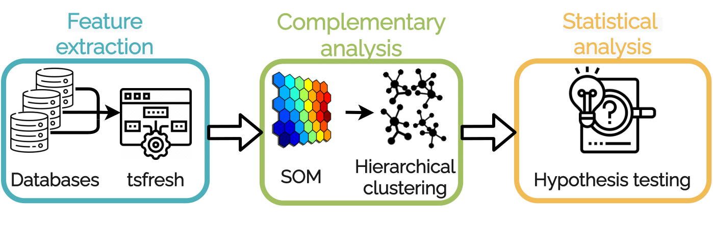

# STAMP

---

## Data

Results for individual steps of the analysis are available [here](https://portal.ijs.si/nextcloud/s/Fi35sGdwk66fTR9). Results of different pipeline steps are organized into subdirectories:

- `48x48 coverage matrix`

    Results of performing hierarchical clustering on 2304 (48x48) codebooks obtained with running SOM clustering. The output is a collection of 2304 instances clustered into 6 distinct clusters.

- `Bootstrapping statistical evaluation`

    The folder consists of data used for statistical analysis performed by Friedman and further by the post-hoc Nemenyi test.
    Example: ../48_48/90/3/. It means that for SOM grid 48x48 and 6 clusters, the threshold for selecting representatives is 90%, and for each cluster we selected 3 datasets as representatives. The provided data is the data involved in the bootstrapping approach analysed by the Friedman and the Nemenyi test. There are 4 thresholds available (i.e., 50%, 80%, 90%, and 100%) and for each one three sample sizes are investigated (i.e., 2, 3, and 4).

- `SOM evaluation`

    A collection of different quality measures obtained during SOM clustering. Quality measures are reported SOM with different numbers of codebooks.
    The folder consists of three files that are the results of the grid search of the SOMs.
    top_error_all.txt - data where the first column is the size of the configuration and the second is the topographic error.
    quant_error_all.txt - data where the first column is the size of the configuration and the second is the quantization error.
    expl_var_all.txt - data where the first column is the size of the configuration and the second is the percentage of the explained variance.

---

## Code

- `Bootstrapping_statistical_evaluation.R`

    R code for performing the hypothesis testing. This code can be used to produce tables with p-values that are then trasnfomred into 0 and 1 in the tables presented in the paper. The results generated by this code and used in the paper are also available in  Data/Bootstrapping statistical evaluation.

- `SOM_training.R`

    Train a self-organizing map on feature vectors extracted from time series instances.

- `clustering_som_codebooks.py`

    Perform clustering on 2304 codebooks obtained with SOM. Different clustering approaches (hierarchical clustering, K-means) are tested to discover what approach produces the best coverage matrix.

- `clustering_som_codebooks_viz.ipynb`

    Visualization of clusters and metrics describing the quality of obtained clustering results.

- `coverage_matrix.R`

    Compute a coverage matrix that describes how instances of a particular dataset are distributed over multiple obtained clusters.

- `coverage_matrix_viz.ipynb`

    Visualize a computed coverage matrix.

- `util.py`

    Ubility functions

---

## Code not used in the paper

- `instance_results_analysis.ipynb`

    Analysis script.

- `test_script.ipynb`

- `time_series_classification_HIVE_COTE.py`

    HIVE COTE model for time series classification.

- `training_models.ipynb`

    Bulding meta models on data from individual clusters on 1000/2000.
